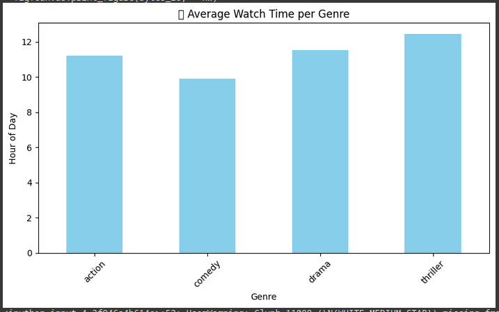

# Movie Watch Pattern Clustering and Classification

## Overview

This project explores user movie watch patterns, including genre preferences, watch time, and rating behaviors, using machine learning techniques. The primary goals are to **segment users** based on their viewing habits and to **predict genre preferences** using a classification model. The project leverages **K-Means clustering** for segmentation and **Random Forest** for classification, along with various evaluation metrics and visualizations to assess performance.

## Key Features

- **Clustering:** Segment users into distinct groups based on their movie watch patterns.
- **Classification:** Predict users' genre preferences using a Random Forest classifier.
- **Evaluation Metrics:** Accuracy, precision, recall, and confusion matrix heatmaps to evaluate classification performance.
- **Visualization:** Generate insightful plots, including bar charts, pie charts, and PCA-based clustering visualizations.

## Technologies Used

- **Python**: Core programming language
- **Pandas**: Data manipulation and analysis
- **Matplotlib/Seaborn**: Data visualization
- **Scikit-learn**: Machine learning models and metrics
- **K-Means**: Clustering algorithm for user segmentation
- **Random Forest**: Classification algorithm for predicting genre preferences

## Installation

To get started with this project, you'll need to have Python 3.x installed along with the required libraries. Follow these steps to install the dependencies:

1. Clone this repository:
    ```bash
    git clone https://github.com/yourusername/movie-watch-pattern-clustering.git
    cd movie-watch-pattern-clustering
    ```

2. Create a virtual environment (optional but recommended):
    ```bash
    python -m venv venv
    source venv/bin/activate  # On Windows use `venv\Scripts\activate`
    ```

3. Install the dependencies:
    ```bash
    pip install -r requirements.txt
    ```

4. Start using the code by uploading your dataset and running the analysis.

## Dataset

The dataset contains information about user preferences, including:
- **genre_preference**: The genre the user prefers.
- **watch_time_hour**: The total hours spent watching content.
- **avg_rating_given**: The average rating given by the user.

### Example CSV Format:
| genre_preference | watch_time_hour | avg_rating_given |
|-------------------|-----------------|------------------|
| Action            | 120             | 4.5              |
| Drama             | 80              | 3.8              |
| Comedy            | 150             | 4.2              |

## Workflow

### 1. **Data Preprocessing**

- Clean and preprocess the data for machine learning tasks.
- Normalize and encode the categorical variables.
  
### 2. **Segmentation (Clustering)**

- Use **K-Means clustering** to segment users based on their **watch time** and **genre preferences**.
- Visualize the results using **PCA** for dimensionality reduction.

### 3. **Classification**

- Train a **Random Forest classifier** to predict genre preferences based on **watch time** and **average rating**.
- Evaluate the model using **accuracy**, **precision**, and **confusion matrix heatmaps**.

### 4. **Evaluation**

- Visualize and evaluate the model’s performance using **classification metrics** and **confusion matrix heatmaps**.
- Use the **classification_report** to display precision, recall, and F1-score.

## Results

### Clustering:


### Average Watch Time per Genre:


### Average Rating per Genre:


### Genre Time Distribution:


### PCA-based User Segmentation:


## Example Code Snippets

```python
# Data Preprocessing and Label Encoding
df['genre_encoded'] = LabelEncoder().fit_transform(df['genre_preference'])

# K-Means Clustering
scaler = StandardScaler()
X_cluster = scaler.fit_transform(df[['watch_time_hour', 'avg_rating_given']])
kmeans = KMeans(n_clusters=3, random_state=42)
df['cluster'] = kmeans.fit_predict(X_cluster)

# Classification with Random Forest
X = df[['watch_time_hour', 'avg_rating_given']]
y = df['genre_encoded']
X_train, X_test, y_train, y_test = train_test_split(X, y, test_size=0.2, random_state=42)
model = RandomForestClassifier()
model.fit(X_train, y_train)
y_pred = model.predict(X_test)
